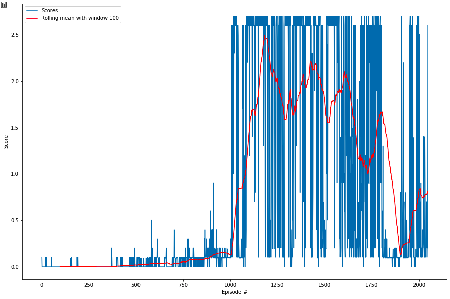

# Report Project 3: Collaboration and Competition

## By: Alex Wong

### Introduction

This report explains the algorithm behind the two agents to control rackets to bounce a ball over a net.

### Learning Algorithm

The DDPG algorithm is used to train the agents and solve the environment. The following paragraph explains how the agents learn using the DDPG algorithm.

#### DDPG Algorithm

The 2 agents train for `n_episodes` number of episodes and each episode is capped at `tmax` steps to ensure that an episode stops.

For each step the agents select an action using the local actor neural network, where some noise is added to allow for exploration. The noise is produced using a Ornstein-Uhlenbeck (OU) process, this process is controlled by the noise parameters `OU_THETA` and `OU_SIGMA`. The noise produced in the OU-process is then multiplied with `epsilon` and its result is added the agents' actions. The noise parameter `epsilon` is initiated at `EPSILON` and decays over time with `EPSILON_DECAY` per learning update. The idea is that in the beginning `epsilon` is set to a high value to allow for a lot exploration in the beginning and it decays over time as the agent converges to a solution.

During the timestep the 2 agents each add their current `state`, `action`, `reward`, `next_state` and `done` to a shared memory with size `BUFFER_SIZE`. When the buffer is sufficiently large, i.e. enough samples to fill a mini batch with size `BATCH_SIZE` and when sufficient time steps `LEARN_EVERY_T_TIMESTEPS` in the episode have elapsed the agent will learn for `UPDATE_N_TIMES` times using randomly selected samples from its memory (this removes the correlation between samples).

When the agent learns it will update the actor and critic networks. To update the local critic we first compute `actions_next` and `Q_targets_next` with the target actor and the target critic. Afterwards we can compute `Q_targets` with `Q_targets = rewards + (gamma * Q_targets_next * (1 - dones))`, where the hyperparameter `GAMMA` is the discount factor of the future rewards. `Q_expected` is computed using the local critic neural network. With `Q_targets` and `Q_expected` we can compute the mean squared error and update the local critic neural network with backpropagation, where the gradient is clipped to stabilize learning.

The local actor neural network is updated by first computing `actions_pred` by inputting the `states` in the local actor neural network. Given the predicted actions of the local actor, we let the local critic evaluate the actions, where we take the mean over the scores assigned to the prediction actions `actions_pred` given the `states` to get the `actor_loss`, which can then be used to update the weights in the local actor neural network using backpropagation.

Both neural networks use the Adam optimiser to update their weights, which is controlled by the learning rate `LR_ACTOR` and `LR_CRITIC` for the actor and critic network respectively. In addition, a L2 regularisation term `WEIGHT_DECAY` is also used, which adds a penalty to the loss if the weights in the network grow too large, this is done to prevent overfitting.

After we have updated the local actor and critic neural networks, we perform a soft update of the target actor and critic neural networks. The soft update is controlled by the hyperparameter `TAU`, which determines how much of the weights of the local networks is copied over to the target networks.

In the final step of the learning phase we reset the OU noise process and update `epsilon` by subtracting `EPSILON_DECAY` from it, if `epsilon` becomes too low it will be set to `EPSILON_DECAY` to allow for a little bit of exploration.

#### Neural Network Architecture

The architecture of the actor is a neural network with two fully connected layers, where batch normalization is performed after the first layer. The `relu` activation function is used and each layer has `256` units. The final activation function is a `tanh` function to get outputs between -1 and 1.

The architecture of the critic's neural network with four fully connected layers, where batch normalization is performed after the first layer. A `leaky_relu` activation is used, where the negative slope of the `leaky_relu` activation function is controlled by the hyperparameter `LEAK`. The first and second layer have `256` units, the third and fourth layer have `128` units. No activation function is used at the final layer.

### Hyperparameters

The values for all the hyperparameters are:

```
BUFFER_SIZE = int(1e6)              # replay buffer size
BATCH_SIZE = 128                    # minibatch size
GAMMA = 0.99                        # discount factor
TAU = 1e-3                          # for soft update of target parameters
LR_ACTOR = 1e-4                     # learning rate of the actor
LR_CRITIC = 1e-3                    # learning rate of the critic
WEIGHT_DECAY = 0                    # L2 weight decay
LEARN_EVERY_T_TIMESTEPS = 1         # learning timestep interval
UPDATE_N_TIMES = 1                  # number of learning passes
EPSILON = 10.0                      # explore vs exploit tradeoff parameter
EPSILON_DECAY = 1e-1                # decay parameter for epsilon
OU_SIGMA = 0.2                      # Ornstein-Uhlenbeck noise parameter
OU_THETA = 0.15                     # Ornstein-Uhlenbeck noise parameter
LEAK = 0.01                         # parameter for leaky relu
```

### Plots of Rewards

Below is a plot of the maximum reward of the 2 agents per episode. The environment was solved in 907 episodes, i.e. an average reward of +0.5 over the maximum score of the 2 agents per 100 episodes was reached in 907 episodes.



### Ideas for Future Work

The learning algorithm could be improved by:
* Try different hyperparameters:
    * Try different values for `LR_ACTOR` and `LR_CRITIC`, the learning rate of the neural networks. Experiment with update schemes for the learning rate, instead of keeping it constant.
    * Try different update schemes for `epsilon` with different values for `EPSILON` and `EPSILON_DECAY`.
* Try different architecture for the neural networks:
    * Try different activation functions.
    * Try different number of layers and number of activation units in the neural networks.
    * Try different weight initialisations.
* Try Prioritised Experience Replay: do not uniformly sample from the memory, but place higher probabilties on important experiences.
